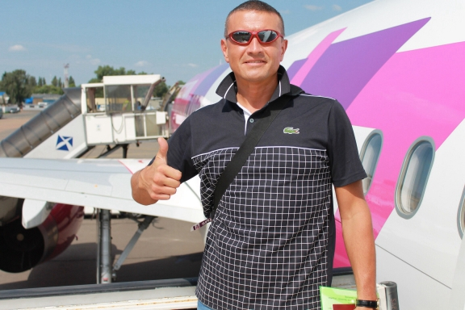

## Personal information

**FIRST NAME / LAST NAME**  *Stanislav Cherevkov* 
**THE ADDRESS**  *Ukraine, Odessa city* 
**SPECIALISATION**  *WEB Developer (Remote)*

**EMAIL**  *web--dev@hotmail.com* 
**SKYPE**  *live:.cid.eee0b3763fe6c06e* 
**TELEGRAM**  *@html_js_css_php* 
**AGE**  *49* 
**GENDER**  *Mail* 

**About me**

Engaged in Web development. I specialize in layout and further integration with CMS Wordpress. In total, he developed about 20 projects. I have experience with backend - Laravel (2 projects). I want to eventually get into serious full-stack development React + Laravel. For this, I need good knowledge of JS, which the school gives. Before that, I used only JQuery, it was enough. My dream is to work in EPAM.

## Work experience

**September 2020 - Now**  *Freelance* 
**September 2014 - September 2019**  *Absence from work due to treatment* 
**August 1997 - October 2013**  *Khmelnitsky customs (Inspector)* 
**September 1996 - August 1997**  *Khmelnitsky KPO plant (Programmer)*

## Education

**1996 - 2000**  *Technological University of Podolia (Economy)* 
**1991 - 1996**  *Technological University of Podolia (Engineering technology)*

## Skils

**LANGUAGES** 
- *Russian - fluent*
- *Ukrainian - fluent*
- *English - middle level*

**SPECIAL ABILITIES AND SKILLS**
- *HTML5*
- *CSS3*
- *SASS*
- *Gulp*
- *JQuery*
- *Bootstrap*
- *PHP*
- *Laravel*
- *Wordpress*
- *October CMS*
- *Figma*

## Some of my work

- [Vip auto-serviceMercedes-Benz](https://mbservice.ua) 
- [Royal Palace Marmur](https://royalpalace-marmur.com.ua) 
- [Armata Financial Group](http://my-portfolio.ho.ua/gfg/) 
- [Royal Cafe](http://my-portfolio.ho.ua/cafe/) 
- [Woodtech](http://my-portfolio.ho.ua/woodtech/) 
- [Hounter](http://my-portfolio.ho.ua/hounter/) 